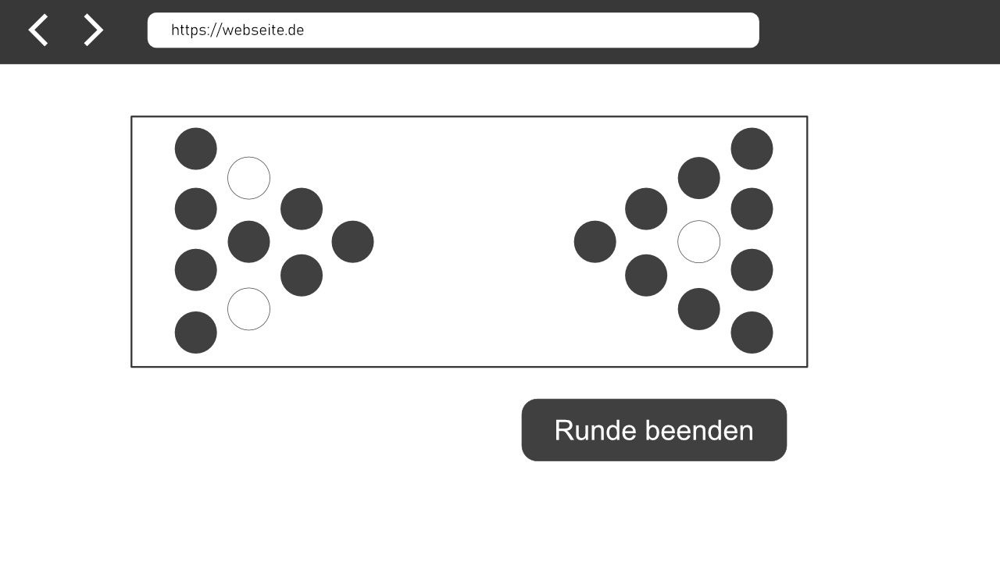
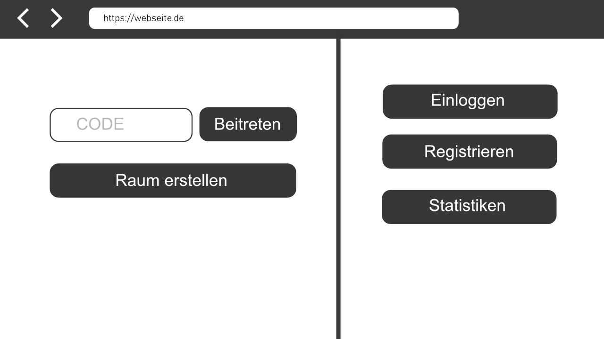
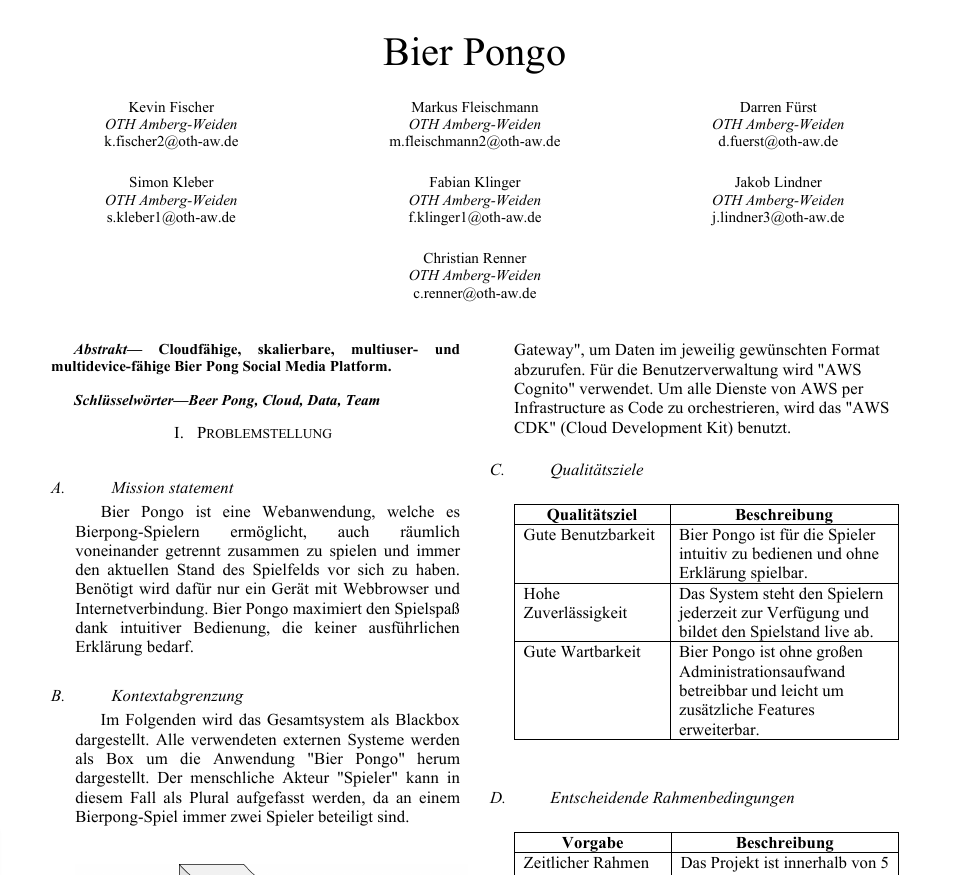
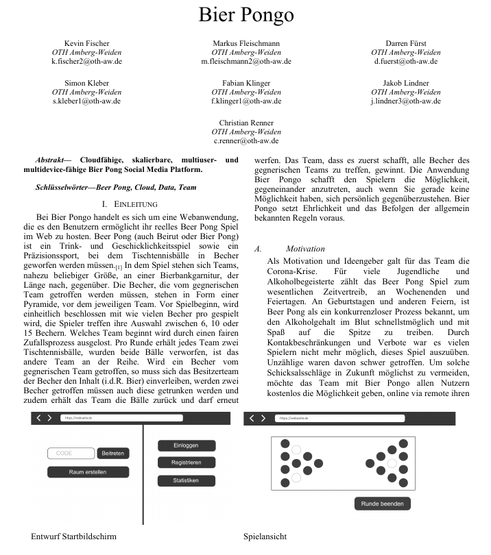

# BeerponGo 

Projekt des Moduls `Big Data, Cloud & NoSQL`

**Betreuer:** Prof. Dr.-Ing. Christoph P. Neumann

**Team:** Kevin Fischer, Markus Fleischmann, Darren Fürst, Simon Kleber, Fabian Klinger, Jakob Lindner, Christian Renner

**Studiengang:** Bachelor Künstliche Intelligenz


# Konzept von Spielfläche & Menü


---



## Kurzinfo 
Cloudfähige, skalierbare, multiuser- & 
multidevice-fähige Bier Pong Social Media Platform.

Bier Pongo ist eine Webanwendung, welche es
Bierpong-Spielern ermöglicht, auch räumlich
voneinander getrennt zusammen zu spielen und immer
den aktuellen Stand des Spielfelds vor sich zu haben.
Benötigt wird dafür nur ein Gerät mit Webbrowser und
Internetverbindung. Bier Pongo maximiert den Spielspaß
dank intuitiver Bedienung, die keiner ausführlichen
Erklärung bedarf.

# Architekturpapier
`Vorschau:`



[`Ganze Datei öffnen` (sys-doc/Architektur/20220627_TeamBlau_Architektur.pdf)](sys-doc/Architektur/20220627_TeamBlau_Architektur.pdf)

# Konzeptpapier
`Vorschau:`



[`Ganze Datei öffnen` (sys-doc/Konzept/Konzeptpapier_BierPongo.pdf)](sys-doc/Konzept/Konzeptpapier_BierPongo.pdf)


# Run

## Prerequisites
- make (choco install make)
- aws cli (https://docs.aws.amazon.com/cli/latest/userguide/getting-started-install.html)
- aws-cdk (npm install -g aws-cdk)
- aws-cdk profile: Add following to ~/.aws/config
- Node.js (https://nodejs.org/)
- Docker (Windows: https://docs.docker.com/desktop/windows/install/)

  ```
  [profile bierpongo-user]
  region=eu-central-1
  aws_access_key_id=XXX
  aws_secret_access_key=XXX
  ```


## pipenv - Python dependency administration
Doc: https://pipenv.pypa.io/en/latest/

### If you want to install a new package:
1. Navigate to the `Pipfile` directory of your source code
2. Run `pipenv install [PACKAGE_NAME]` and add `-d` if it is a package vor developing or testing purposes

With `pipenv install` without a package name you can install all necessary packages for this Pipfile source directory.

### If you want to run your code using dependencies installed with pipenv
Run `pipenv run [SCRIPT_NAME]` like `pipenv run pytest` to run tests


## Prepare and Install
Prepare python and pipenv:
```
make prepare
```
Install pipenv dependencies:
```
make install
make install-infrastructure
make install-backend
make install-frontend
```


## Test
Run unit tests:
```
make test
make test-infrastructure
make test-backend
make test-frontend
```


## Test Coverage
Run unit tests:
```
make test-coverage
make test-coverage-infrastructure
make test-coverage-backend
make test-coverage-frontend
```


## Deploy
Deploy infrastructure stacks to AWS and build frontend docker container:
- `env`: The deployment environment. The name of a yaml file in the config folder, e.g. `dev` or `prod`.
- `deployment-profile`: The deployment profile, which links to a user. Like above use `bierpongo-user`.
- `stack_id`: The id of the stack you want to deploy. For a deployment of all stacks use `--all`.
```
make deploy PROFILE=<deployment-profile> STACK=<stack_id> CONFIG=<env>
```
Deploy infrastructure stacks to AWS:
```
make deploy-infrastructure PROFILE=<deployment-profile> STACK=<stack_id> CONFIG=<env>
```
Build frontend docker container:
```
make build-docker-frontend
```


Destroy deployed infrastructure stacks in AWS:
```
make destroy-infrastructure PROFILE=<deployment-profile> STACK=<stack_id> CONFIG=<env>
```


## Formatting
Run python formatting checks for infrastructure code:
```
make formatting-checks
make formatting-checks-infrastructure
make formatting-checks-backend
```
Auto-format python infrastructure 
```
make format
make format-infrastructure
make format-backend
```
